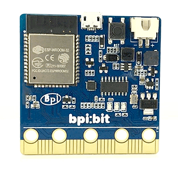

# MircoPython - IO
#### 📖 [English document](https://github.com/aJantes/MircoPython-IO/blob/master/README.md)

> Hardware introduction：
1. [BPI:bit(ESP32)](https://github.com/aJantes/introduce-bpi-bit/blob/master/README.md)
2. Direct insertion LED

# Control IO

IO in computer refers to Input/Output, that is, input and output, referred to as IO port.

## **Controlling the Input and Output of IO Port**

Hardware correlation function of IO port [pin Modular](https://github.com/aJantes/MicroPython-IO/blob/master/source/pins.py).Before calling related functions, you need to import the corresponding libraries.
## Main functions
1. `pin1.is_touched()`:

For example：
 ```
 if pin1.is_touched():
    Execution statement 1
 ```
Determine whether the pin on label 1 is touched or not, and execute statement 1 if touched.

2. `pin2.write_digital()`:

For example：`pin2.write_digital(1)` Pin Output High Level in Label 2; `pin2.write_digital(0)` Output low level at label pin 2.


## ** Example **
1. [shy.py](https://github.com/aJantes/MircoPython-IO/blob/master/example/shy.py)   -Shy board
2. [blink.py](https://github.com/aJantes/MircoPython-IO/blob/master/example/blink.py) -LED twinkle


